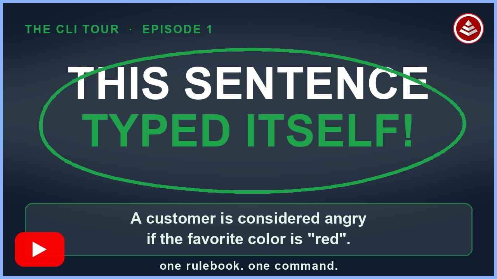

# Effortless CLI

[](https://tinyurl.com/27dephkb "Your First Rulebook — watch on YouTube")

**▶ [Watch: Your First Rulebook](https://tinyurl.com/27dephkb)** (7:48) — a real run in
an empty folder. `-init` hands you a working rulebook, one command turns it into a
plain-English rules document, and when the rule changes the document follows on its
own, because nobody was maintaining it in the first place.

`effortless` is the command-line client for EffortlessAPI transpilers. It reads an
`effortless.json` project, resolves tools from the REST catalog, sends file sets to
those tools over HTTP, and writes or cleans the generated outputs.

The same CLI is installed under four compatible command names: `effortless`,
`ssotme`, `aicapture`, and `aic`. It was formerly the SSoT.me CLI.

User state lives in `~/.effortless`. The first run after upgrading from a
`ssotme`-era install copies an existing `~/.ssotme` there (key files and the
tool catalog are renamed on the way) and leaves `~/.ssotme` in place with a
`MIGRATED-TO-EFFORTLESS` marker, so an older `ssotme` binary keeps working. A
project's `.ssotme` build-state directory is renamed to `.effortless` the first
time the project is loaded.

## Install

### npm

.NET 8 and Node.js are required:

```bash
npm install -g @effortlessapi/cli
effortless -version
```

The official npm package is `@effortlessapi/cli`. The unscoped npm package
named `effortless` is unrelated software and must not be used.

The npm shim builds the `Effortless.Cli` project in Release mode when the
compiled CLI is missing or the package version changed.

### Development checkout

```bash
git clone https://github.com/EffortlessAPI/cli.git
cd cli
npm install -g .
effortless -version
```

### Windows MSI and macOS PKG

Download the appropriate MSI or PKG from the repository's GitHub Releases page.
Both installers place all four command aliases on `PATH`.

To upgrade an existing installation from the command line:

```bash
npm install -g @effortlessapi/cli@latest
```

`effortless -checkVersion` also checks GitHub for the latest commit on `main`
and, with your confirmation, reinstalls via npm. The CLI also runs this check
at most once per day in the background; run `effortless -checkVersion` once to
choose Always (auto-reinstall silently) or Never (skip until asked again).

## Quick start

Initialize a project in the current directory:

```bash
effortless -init
```

Install a transpiler invocation into `effortless.json`:

```bash
effortless rulebook-to-rulespeak -install \
  -i effortless-rulebook/effortless-rulebook.json
```

Run all enabled project steps:

```bash
effortless build
```

Remove files recorded in the generated-file ledgers:

```bash
effortless clean
```

## Commands

The command summary below is generated from
`effortless-rulebook/effortless-rulebook.json`, the same source as `-help` and
[docs/cli-reference.md](docs/cli-reference.md), so the three cannot drift.

<!-- cli-commands:start -->

### CLI meta

- `-help` — Show usage and available commands
- `-info` — Show CLI/user configuration and login status
- `-version` — Print the CLI version

### Project file

- `-init` — Create effortless.json and a starter rulebook here
- `-describe` — Describe steps in this folder and its children

### Install / uninstall tools

- `-install` — Register a transpiler step in effortless.json
- `-uninstall` — Remove a registered step from effortless.json

### Build

- `-build` — Build steps in this folder and its children
- `-buildAll` — Build the whole project from its root
- `-buildLocal` — Build only steps registered exactly here

### Clean

- `-clean` — Delete generated output here and below
- `-cleanAll` — Clean the whole project from its root
- `-cleanLocal` — Clean only steps registered exactly here

### Local tools (effortless-tools/, serve)

- `-serve` — Host this project's local tools over HTTP

Run `effortless -help <category|option>` for one topic, or
`effortless -help all` for every option.
<!-- cli-commands:end -->

## Local tools

A project can carry its own transpilers next to the rulebook and reference
them in `effortless.json` exactly like catalog tools. The CLI hosts them over
the same REST contract published tools speak, so the ledger, `clean`, `-debug`,
and `-continueOnError` behave identically.

```
effortless-tools/
  echo-params/transpiler.sh        # script: any executable or interpreted file
  to-upper-node/package.json       # node:   a small HTTP tool on the shipped fileset handler
  to-upper-dotnet/ToUpper.csproj   # dotnet: the same shape as a published cloud tool
```

The folder name is the tool name (lower-hyphen). An optional `tool.json`
(`{ "name", "runtime": "dotnet" | "node" | "script", "entry", "description", "tags" }`)
overrides the inference above.

- **script** tools get directories, not HTTP: `EFFORTLESS_INPUT_DIR` holds the
  input fileset, everything written under `EFFORTLESS_OUTPUT_DIR` becomes the
  output fileset, and `EFFORTLESS_OUTPUT_NAME`, `EFFORTLESS_PARAMS` (JSON array
  of the `name=value` params) and `EFFORTLESS_TOOL_NAME` carry the rest. A
  non-zero exit fails the step with the script's output as the tool log.
  Overwrite behaviour is the protocol's: write `effortless-overwrite-modes.json`
  into the output directory (`{ "sql/*b-customize-*.sql": "Never", "sql/**": "Always" }`)
  to set each file's `OverwriteMode`; an undeclared file is written once and
  never overwritten, exactly as for every other tool.
- **node** tools are started with `PORT` set and answer `POST /`. The CLI passes
  the path of its zero-dependency handler in `EFFORTLESS_FILESET_HANDLER`:
  `const { serveTool } = await import(process.env.EFFORTLESS_FILESET_HANDLER);`
  then `serveTool({ transpile: ({ inputFiles, outputName }) => [{ relativePath, contents, alwaysOverwrite: true }] })`.
  The handler is also `lib/fileset-handler.mjs` in the npm package and exposes a
  plain `(req, res)` listener for express.
- **dotnet** tools are started with `dotnet run --project` and `PORT` set, which
  is exactly what `CLIClassLibrary.StartToolListener` reads, so a local tool
  folder can later be published unchanged.

```bash
effortless echo-params -input README.md -output echo.txt   # ephemeral host, started and stopped for this run
effortless build                                           # same: one ephemeral host for the whole build
effortless serve -port 4242                                # resident host; builds reuse it via .effortless/serve.json
```

A `-setToolUrl` mapping still wins over a same-named local tool, so a local
tool can be pointed elsewhere for debugging. Local tools are not
catalog-versioned (no pin, no `[latest]`; the label is `<name> [local]`) and a
nested project does not inherit its parent's `effortless-tools/`.

## Seeds

An Effortless seed is a public GitHub repository with `effortless.json` at its
root: a whole starter project, root or child, that you clone and build. Seeds
are discovered across an ordered list of GitHub accounts, the **seed sources**.
The defaults are `ssotme` and `effortlessapi`; the list lives in
`~/.effortless/seed_sources.json` once you change it.

```bash
effortless listSeedSources                 # ssotme (default), effortlessapi (default)
effortless addSeedSource my-org            # search my-org too (appended, persisted)
effortless removeSeedSource ssotme         # defaults can be removed

effortless listSeeds                       # every seed, grouped by account, with descriptions
effortless listSeeds my-org                # one account only
effortless cloneSeed my-org/my-seed        # exactly that repository
effortless cloneSeed my-seed [dir]         # searched across the sources; must match in exactly one
cd my-seed
effortless build                           # nothing runs until you do this
```

`EFFORTLESS_SEED_GITHUB_ACCOUNT` adds one more account, searched first, for a
single invocation. Cloning preserves `.git` and never executes downloaded
code. A seed that ships `effortless-seed.json` (an older `ssotme-seed.json`
is also read) declares `$key$` replacements; on the first project load each
key is filled from `seed-config-values.json`, `seed-secret-values.json`, a
parent folder's `seed-config-values.json`, the key's `default`, or a prompt,
and the tokens are replaced in file contents and file names.

## Build on a cloud trigger

Watch the live Airtable trigger bridge and rebuild after changes have been quiet
for ten seconds:

```bash
effortless build -buildOnTrigger <baseId>
```

The watcher polls every three seconds. Transport, HTTP, or malformed-payload
failures stop the command instead of being treated as an unchanged base.

Use `effortless -help` for command-line help. The generated command reference is
at [docs/cli-reference.md](docs/cli-reference.md), and the REST-only rebuild
history is under [docs/refactor-plan/](docs/refactor-plan/).

## Surviving a broken transpiler: `-continueOnError`

By default, `effortless build` stops at the first step that fails. That is the
right default for CI and for a one-shot build you are watching — but it is the
wrong default for any long-running host that builds a whole pipeline and then
runs the result, because one non-load-bearing step (an export, a docs
generator) takes down every load-bearing step with it.

```
effortless build -continueOnError
```

Aliases: `-coe`, `-ignoreErrors`, `-ignoreError`. Defaults to **off**.

With the flag set:

- **Every remaining step still runs.** A step that fails — whether it returns a
  non-zero result *or throws* — is recorded and skipped, and the build moves on.
  (The older `-ignoreErrors` flag only ever handled the non-zero-return case; a
  throwing step still killed the whole build. That gap is fixed.)
- **The build exits 0.** The run completed; some steps did not.
- **Failures are written to `errors.json` in the project root**, so nothing is
  lost when the build no longer stops to show you. The file is deleted on a
  clean build, so its presence always describes the *most recent* build:

```jsonc
{
  "schema": "effortless-build-errors/v1",
  "generatedAt": "…", "projectRoot": "…", "buildCommand": "build",
  "continueOnError": true,
  "totalSteps": 7, "succeededSteps": 6, "failedSteps": 1, "skippedSteps": 0,
  "failedStepNames": ["rulebooktoxlsx"],
  "steps": [ /* every step, in order, with status — the lightweight index */ ],
  "errors": [
    {
      "name": "rulebooktoxlsx",
      "relativePath": "/xlsx",
      "commandLine": "rulebook-to-xlsx -i ../effortless-rulebook/effortless-rulebook.json",
      "status": "failed",
      "exitCode": -1,
      "message": "…",
      "resolvedVersion": "…", "resolvedUrl": "…",
      "transpilerException": { "type": "…", "message": "…", "stackTrace": "…", "inner": { } },
      "cliException":        { "type": "…", "message": "…", "stackTrace": "…", "inner": { } }
    }
  ]
}
```

`transpilerException` is what the tool itself reported back over the wire;
`cliException` is anything the CLI threw while running that step. Both walk the
full `InnerException` chain — the real cause is often two or three levels below
the message that reaches the console.

A summary is also printed at the end of the build naming each failed step, its
command line, and the path to `errors.json`.

## Contributing

Create a branch, open a pull request, and keep `dotnet test Effortless.Cli.sln`
green. Changes are squash-merged. Maintainers release through
`scripts/release.sh`; do not hand-roll version or publishing steps.

## Upgrading from the SSoT.me CLI

Existing installs and projects keep working: `~/.ssotme` is copied to
`~/.effortless` on first run, `ssotme.json` becomes `effortless.json` when a
project is loaded, and the `ssotme`, `aicapture`, and `aic` commands stay as
aliases. Everything that changed, and what replaced each removed option, is in
[docs/upgrading-from-ssotme.md](docs/upgrading-from-ssotme.md).

## License

See [LICENSE](LICENSE).
